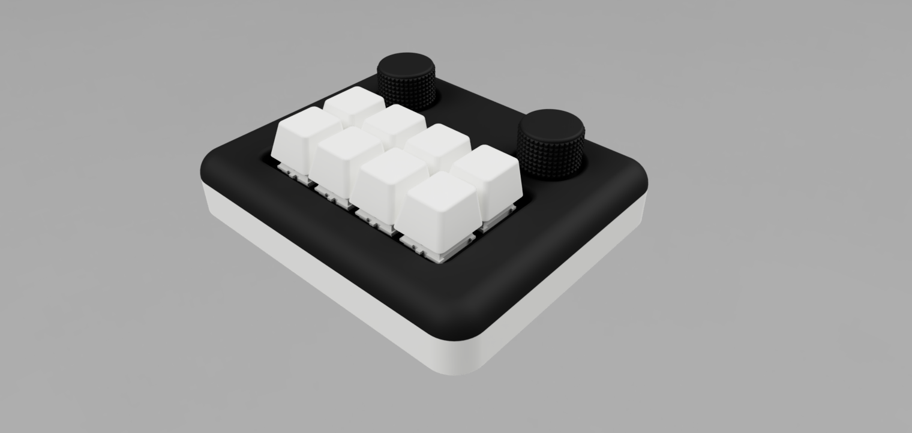

# leroy

This is a hand wired macro pad with 8 keys and 2 encoders.

It's running Vial/QMK on an Arduino Pro Micro (Atmega32u4)

* Keyboard Maintainer: [flbum](https://github.com/flbum)
* Hardware Supported: Arduino Pro Micro (Atmega32u4)
* Hardware Availability: (https://a.co/d/4Hyoo8c)

Make example for this keyboard (after setting up your build environment):

    make leroy:vial

Flashing example for this keyboard:

    make leroy:vial:flash

See the [build environment setup](https://docs.qmk.fm/#/getting_started_build_tools) and the [make instructions](https://docs.qmk.fm/#/getting_started_make_guide) for more information. Brand new to QMK? Start with our [Complete Newbs Guide](https://docs.qmk.fm/#/newbs).

## Bootloader

Enter the bootloader in 2 ways:

* **Bootmagic reset**: Hold down the key at (0,0) in the matrix (usually the top left key or Escape) and plug in the keyboard
* **Physical reset**: Briefly press the short the pins for rst and gnd